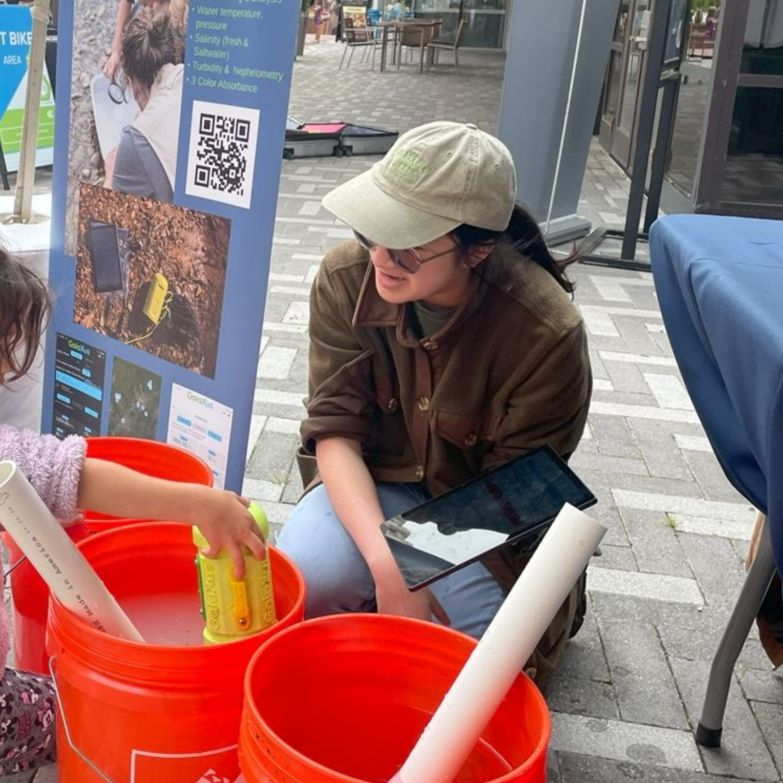
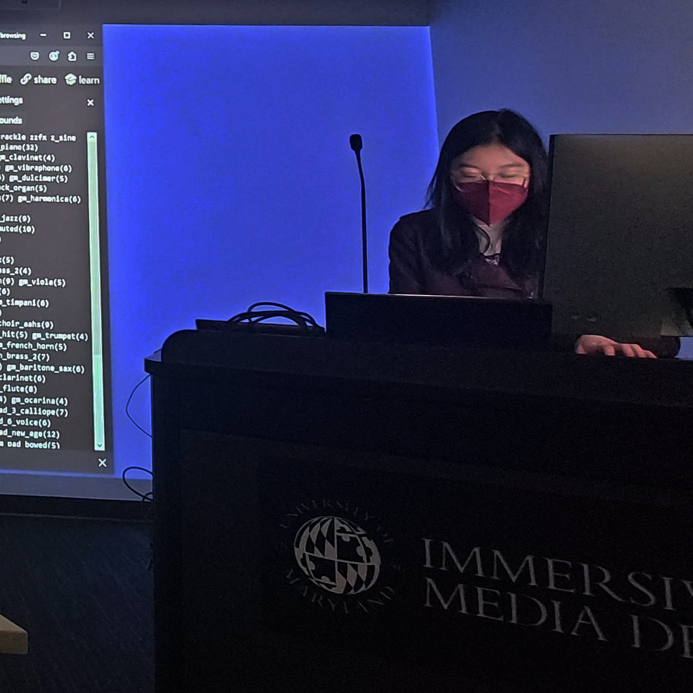
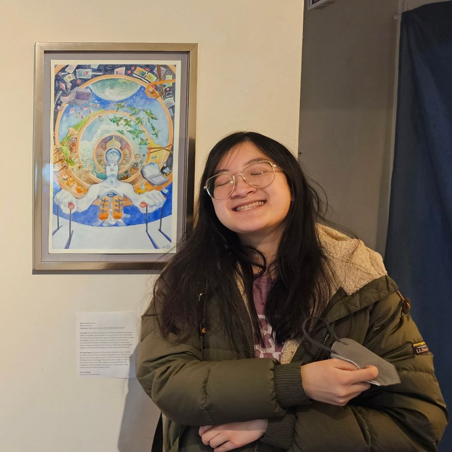

# Caroline Dinh
is a software developer and creative technologist with experience in web frontend, mobile app, and XR development. She has launched [water quality monitoring tools](https://www.youtube.com/watch?v=41rQpFDJqSM){:target="_blank"} for a small startup, been recognized for a [heavy metal data visualization](https://www.informationisbeautifulawards.com/showcase/7368-new-blood-joins-this-earth){:target="_blank"}, and taught [creative](https://www.rhizomedc.org/new-events/2024/11/2/dawn-of-the-livecoding-dead-workshop){:target="_blank"} [coding](https://www.meetup.com/women-and-gender-expansive-coders-dc-wgxc-dc/events/305926052/?eventOrigin=group_events_list){:target="_blank"} [workshops](https://openprocessing.org/sketch/2187370#page-1){:target="_blank"} around the D.C. metro region, where she lives and works.

{:class="profile-image"} {:class="profile-image"} {:class="profile-image"} 

