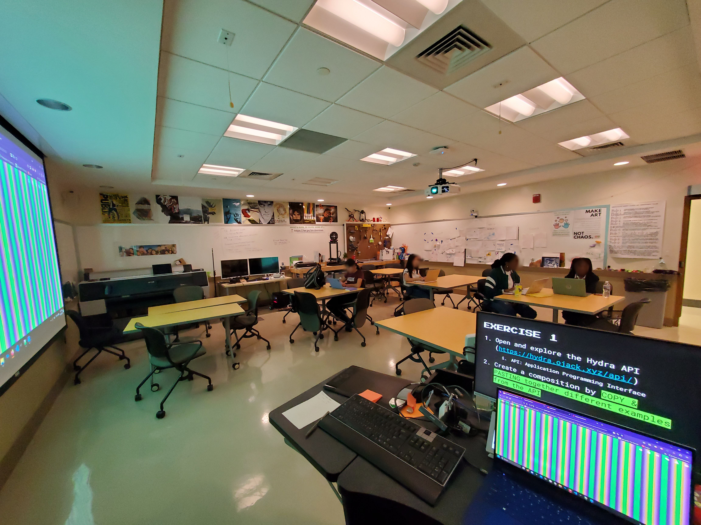
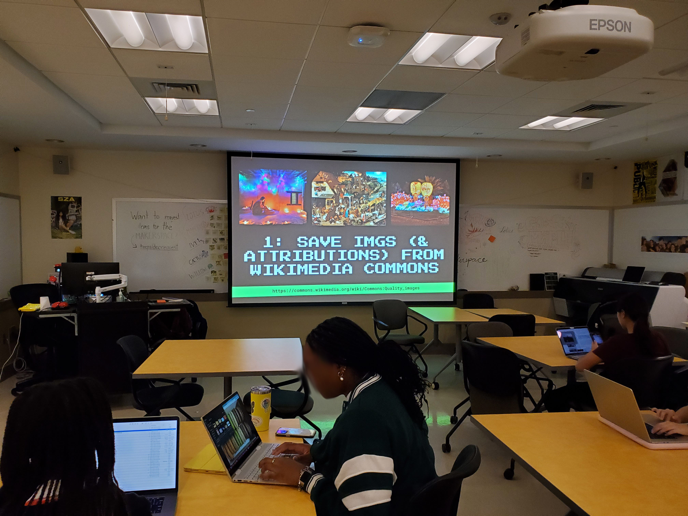

# WORKSHOPS ✦

I am looking for opportunities to do creative coding and zine workshops in the D.C. area. Here is a workshop I did at the University of Maryland:

---

## DCC DESIGN CAMP: CREATIVE CODING AND OPEN SOURCE

<iframe src="https://drive.google.com/file/d/1v-fCV3bBmxRxu8VUgy0QyBEJ1wbC7HvG/preview" width="70%" height="500" allow="autoplay"></iframe>

A 2-day "Design Camp" I hosted for the Design, Cultures, & Creativity Honors College. This workshop was a combination of digital media theory, art history, and hands-on creation where students learned now to create glitch art with Notepad++, livecode with [Hydra](https://hydra.ojack.xyz/), and navigate GitHub. By the end of the workshop, students had made their first pull requests to our workshop's collective "portfolio."  

[Event description](https://dcc.umd.edu/event/dc-dinh-23/){:target="_blank"}

{:class="image-wide"}  
{:class="image-wide"}  